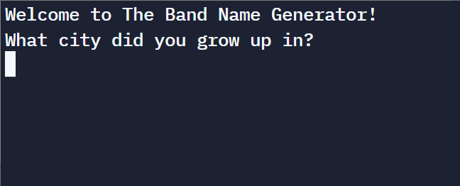

# Day 1 - Working with Variables in Python to Manage Data

## Concepts Practised

- [x] Printing to the Console in Python
- [x] String Manipulation and Code Intelligence
- [x] Debugging
- [x] The Python Input Function
- [x] Python Variables
- [x] Variable Naming

## Brand Name Generator
 
