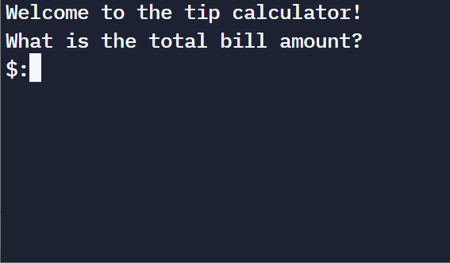

# Day 2 - Understanding Data Types and How to Manipulate Strings

## Concepts Practised

- [x] Python Primitive Data Types  
- [x] Type Error, Type Checking and Type Conversion  
- [x] Data Types  
- [x] Mathematical Operations in Python  
- [x] Number Manipulation and F Strings in Python  

## Tip Calculator
