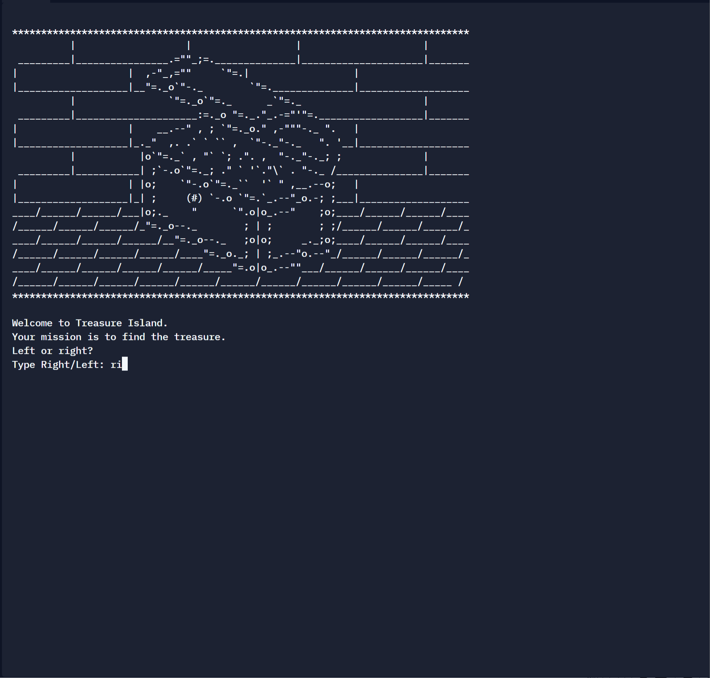

# Control Flow and Logical Operators  

## Concepts practise

- [x] Control flow with if / else conditional operators
- [x] Modulo operator  
- [x] Nested if statements and elif statements  
- [x] Multiple if statements in succession  
- [x] Logical operators  

## Treasure Island 
 
