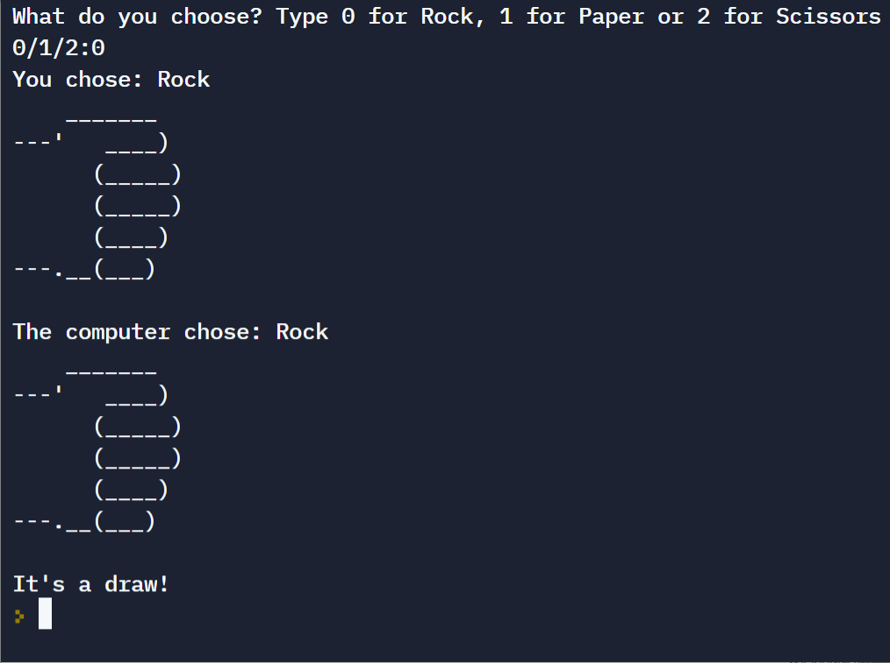

# Day 4 - Randomisation and Python Lists

## Concepts Practised  

- [x] Random Module  
- [x] Understanding the Offset and Appending Items to Lists  
- [x] Index Errors and Working with Nested Lists  

## Rock Paper Scissors  
